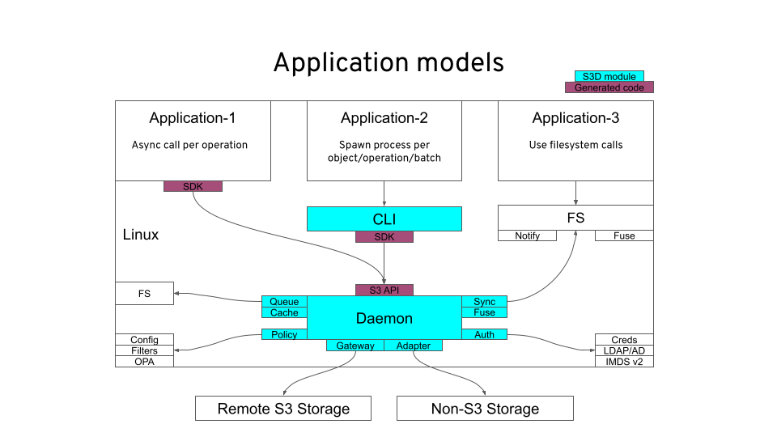

> 🚧  &nbsp; **Warning - work in progress** &nbsp; 🚧
>
> This page is under development and not yet complete.\
> Apologies for the inconvenience.

# System Design



## Service

`s3d` is meant to run alongside the application(s) and provide transparent access to remote S3 storage:

```
/-------------\
| apps -> s3d | ----> remote S3
\-------------/
```

In containerized environments, such as Kubernetes, `s3d` can run in several different ways:
- Per app - as a Pod or Sidecar Container.
- Per node - as a DaemonSet.
- Per cluster - as a scalable fleet of daemons with a Deployment + Service.

## Storage

Every `s3d` instance requires its own local storage volume (FS) to store its data.

This volume is recommended to be persistent to avoid data loss of pending data in the write queue,
but it can be ephemeral and `s3d` will try to flush the data to S3 on shutdown.

The capacity of the volume is not required to have the same size of the remote bucket,
as `s3d` will use it to store pending writes, and cached reads, which allow it to operate
with limited capacity by recycling the available capacity on demand.

## Security

The connection from `s3d` to the remote S3 storage is encrypted and authenticated.
However, the connectivity from clients to `s3d` is currently not encrypted and not authenticated.
For testing and development this works fine, but for real production environments
it will be required to support HTTPS and verify client requests authentication.

# Software Design

In order to keep `s3d` as simple as possible, and yet use bleeding-edge technology and provide a fully capable service for edge computing stack, `s3d` builds on the shoulders of great open source projects.

The following sections describe the software used in the making of `s3d`:

## Rust-lang

- The choice of the Rust language was a natural fit for edge systems,
  as it is a modern language with a focus on functionality, safety and performance.
- Building with the rust toolchain into a single, standalone, lightweight binary,
  makes it easy to set up and configure for linux and containers,
  in order to run alongside any application.
- Libraries from crates.io provide a great set of features for building daemons,
  such as the `tokio` library for async I/O, `hyper` for HTTP, etc.

## Smithy-rs

- [awslabs/smithy-rs](https://github.com/awslabs/smithy-rs) builds the official AWS SDK for Rust.
- It aims for high API compatibility and provides the solid S3 protocol foundation.
- Using it to generate server and client S3 protocol code, and hook in the added functionality.

## Filters

- A simple textual syntax is defined for fine grain object filters
  to include/exclude by bucket-name, key/prefix, tags, headers, meta-data.

## OpenPolicyAgent (OPA)

- [OPA](https://www.openpolicyagent.org/) provides tools for declaring and evaluating policies
  which would extend the capabilities of filters.

## OpenTelemetry (OTEL)

- [OTEL](https://opentelemetry.io/) provides a set of tools for logging, tracing and metrics.
- The [opentelemetry crate](https://crates.io/crates/opentelemetry) provides the library.

## FUSE ("Filesystem in Userspace")

- FUSE provides POSIX-like data access for applications that do not use the S3 API (see [kernel fuse docs](https://www.kernel.org/doc/html/latest/filesystems/fuse.html))
- The daemon binds a FUSE filesystem and creates the mountpoint that maps the filesystem to the S3 API.
- FUSE is a good fit for immutable files, and reading small portions of large datasets.
- FUSE is a **not** a good fit for mutable files (overwrites/appends), or file locks (not supported).
- The [fuser crate](https://crates.io/crates/fuser) is used to set up the FUSE binding.

# Roadmap 

- Wasm support for filters and S3-select.
- Multi-tenancy and authentication:
  - IAM - Identity and Access Management (long-term credentials)
  - STS - Secure Token Service (short-term credentials)
  - IMDSv2 - Instance Meta-Data Service (integrated credential provider)
